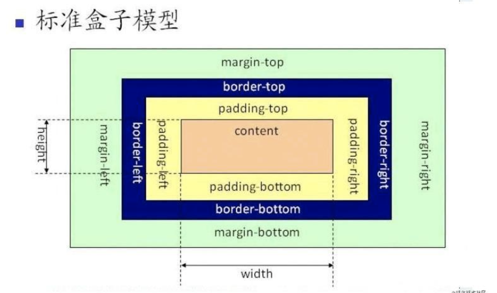
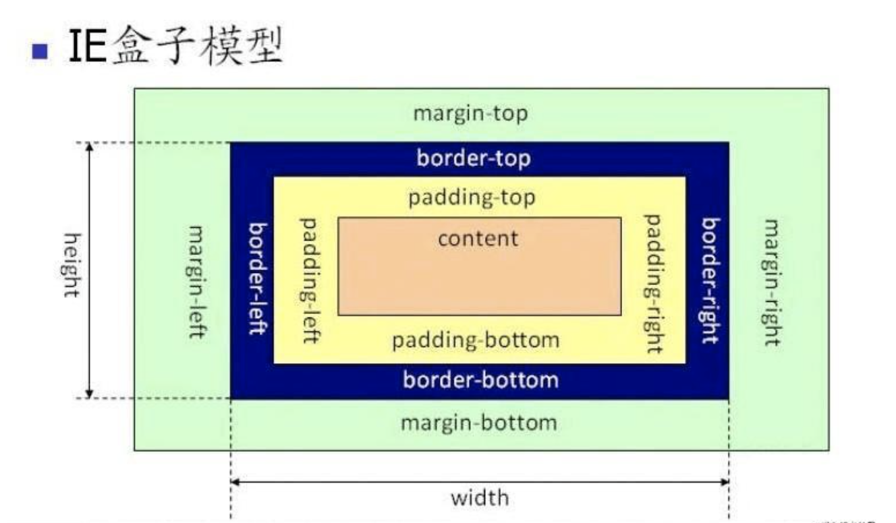
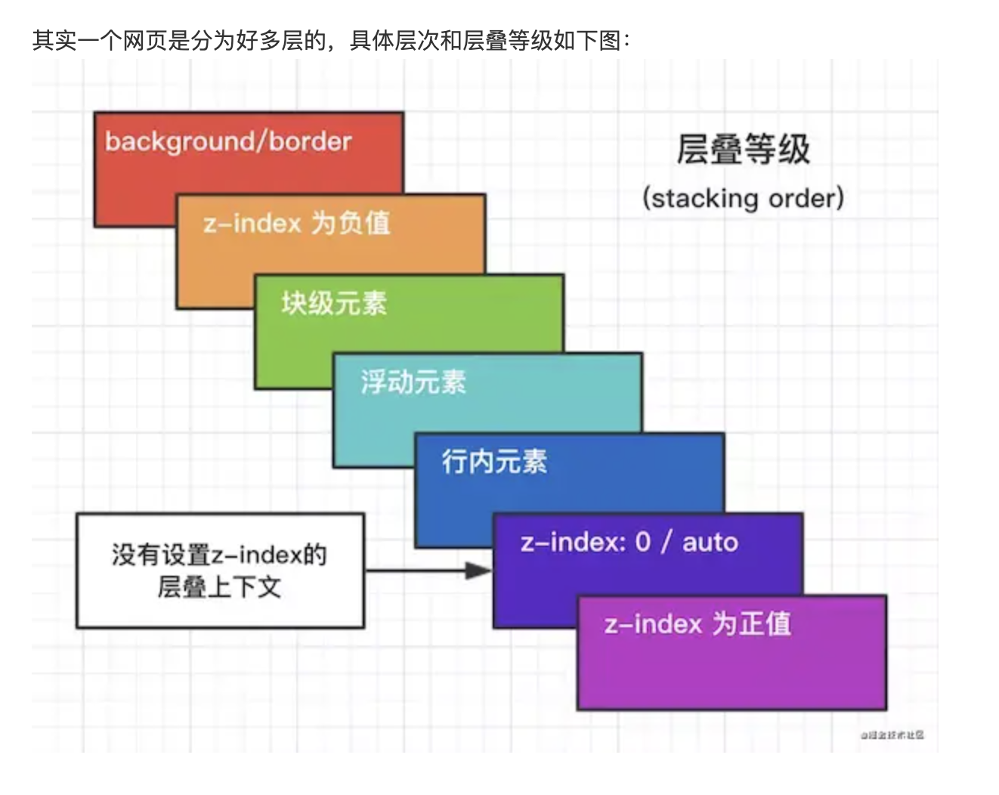
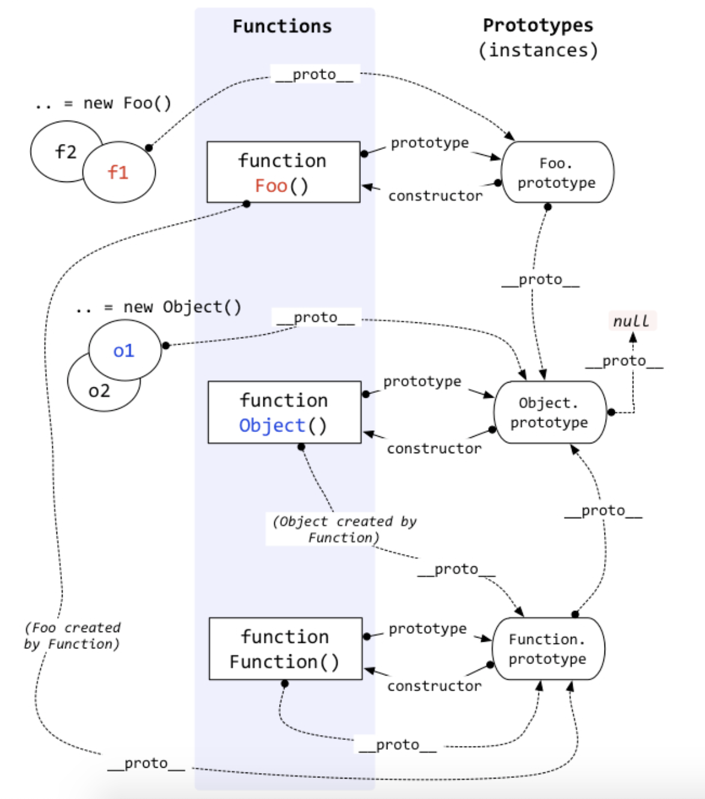

# note

前端学习笔记

# 面试题合集

#### HTML+CSS

https://juejin.im/post/6844903971002253320#heading-1

#### JS 高频面试题汇总

https://juejin.im/post/6844904199017218055

# css 系列

1. **flex 布局？有哪些属性？**

```css
flex;
```

2. **什么是 BFC，如何触发 BFC？**

```css
BFC：块格式化上下文;
触发BFC：
  float不为null;
  position: absolute | fixed;
  display: (inline - block) | flex | (table - cell);
  overflow: hidden | auto | scroll | !visible;
```

3. **css 盒模型**
   标准盒模型：
   
   怪异（IE）盒模型：
   
4. __元素水平垂直居中的方法？__

```css
//方案一：flex布局
父元素: display:flex
box: justifyContent:center
     alignItems:center

//方案二：绝对定位 + transform
//要求box必须有固定的宽高
.box {
  position: absolute;
  top: 50%;
  left: 50%;
  width: 200px;
  height: 200px;
  background-color: pink;
  transform: translate(-50%, -50%);
}

//方案三：table-cell
.box1 {
  width: 300px;
  height: 300px;
  display: table;
  background-color: orange;
}
.content {
  background-color: aqua;
  display: table-cell;
  vertical-align: middle;
  text-align: center;
}
.inner {
  display: inline-block;
}

//方案四：js计算
```

5. __清除浮动的方法有哪些？__

```css
// 浮动的元素后面加div 设置css clear：both
```

6. __CSS 中 link 和@import 的区别是什么？__

```
  a. link属于HTML标签，而@import是CSS提供的，且只能加载 CSS
  b. 页面被加载时，link会同时被加载，而@import引用的CSS会等到页面被加载完再加载
  c.  import只在IE5以上才能识别，而link是HTML标签，无兼容问题
  d. link方式的样式的权重 高于@import的权重
  e. 当使用 Javascript 控制 DOM 去改变样式的时候，只能使用 link 方式，因为 @import 眼里只有 CSS ，不是 DOM 可以控制的。
```

7. __css 动画，transform,transition 和 animation 的区别？分别有哪些属性？__

```css
  transition（过渡）、transform（变换）、animation（动画）

  transition: <property> <duration> <animationType> <delay>
  .transition {
        width: 200px;
        height: 200px;
        background-color: pink;
        -webkit-transition: background-color 1s ease 0.1s, width 1s linear 0.1s,
          height 1s linear 0.1s;
            -moz-transition: background-color 1s ease 0.1s, width 1s linear 0.1s,
          height 1s linear 0.1s;
            -ms-transition: background-color 1s ease 0.1s, width 1s linear 0.1s,
          height 1s linear 0.1s;
            -o-transition: background-color 1s ease 0.1s, width 1s linear 0.1s,
          height 1s linear 0.1s;
            transition: background-color 1s ease 0.1s, width 1s linear 0.1s,
          height 1s linear 0.1s;
      }
      .transition:hover {
        background-color: lightsalmon;
        width: 300px;
        height: 300px;
      }

  transform
    transform的所有变换都是围绕着x轴,y轴，中心点来进行变换。
    如果没有设置transform-origin的话，这个中心点默认就是下图中的center，
    那么css变形进行的旋转，位移所发，扭曲等操作都是以元素自己中心位置进行变形。

    transform-origin：可选9个值，默认值center，需对浏览器进行前缀兼容

    transform: 旋转rotate(30deg)/移动translate(x,y)/缩放scale(0.5)/扭曲skew(x deg, y deg)
    其他属性:
      transform-style:flat(2d)/ preserve-3d(3d空间)
      backface-visibility： 该属性用于隐藏内容的背面。默认情况下，背面可见的，也就是当翻转后，背面内容仍然可见。
      backface-visibility：visible,hidden
      perspective-origin

  annimation
    七个属性
    animation-name: name; (动画名，也就是keyfram中定义的动画名)
    animation-duration: time;（动画持续时间）
    animation-timing-function: ease/linear等;（动画变化的速率）
    animation-delay: time;（动画延迟播放的时间）
    animation-iteration-count: num;（动画循环的次数，infinite是无限次）
    animation-direction: normal;（动画的方向）
      有两个值，默认值为normal，如果是normal动画每次循环都是向前播放的，也就是每次都是从0%播放到100%。
      另一个值是alternate，设定animation-direction为alternate，那么第一次播放到100%后就会从100%播放到0%，如此往返。
    animation-play-state: running; 动画的播放状态
      有两个值running和pause，其中running是默认值，就是在播放。而paused就是暂停播放。而当动画暂停播放后，再重新设置为running的时候，就会从原来的位置重新播放。

```

8. __css 优先级__

```
  !import > 内联样式 > id > class = 伪类选择器(:hover等) = 属性选择器[type等] > 标签 = 伪元素选择器(:after/:before/::selection等) > * 通配符 > 继承的样式
```

9. __css 权重值__
    [权重值比较](https://www.cnblogs.com/cnblogs-jcy/p/8574177.html)：不在赘述

10. __使元素消失的方法有哪些？有什么区别？__

```css
  visibility:hidden;display:none;z-index:-1;opacity:0;
  visibility:hidden;opacity:0;元素依然在文档流中，不会引起页面回流

  opacity:0,该元素隐藏起来了，但不会改变页面布局，并且，如果该元素已经绑定了一些事件，如click事件也能触发
  visibility:hidden,该元素隐藏起来了，但不会改变页面布局，但是不会触发该元素已经绑定的事件
  display:node, 把元素隐藏起来，并且会改变页面布局，可以理解成在页面中把该元素删掉

```

11. __网页的层叠等级(z-index)__
```
    background/border -> z-index 为负值 -> 块级元素 -> 浮动元素 -> 行内元素 -> z-index=0/auto/没有设置 z-index -> z-index 为正值
```
  


# JavaScript 系列

1. __异步解决方案? promise有哪些方法__
```javascript
  回调函数 Promise
  Promise.resolve();
  Promise.reject();

  Promise.prototype.then(fn);
    成功的回调

  Promise.prototype.catch(fn);
    失败的回调

  Promise.prototype.finally(fn);
    无论成功失败总会执行finally()

  Promise.all([p1,p2,p3]);
    所有状态都变成fulfilled，p的状态才会变成fulfilled，此时p1、p2、p3的返回值组成一个数组，传递给p的回调函数。
    只要p1、p2、p3之中有一个被rejected，p的状态就变成rejected，此时第一个被reject的实例的返回值，会传递给p的回调函数。

  Promise.race([p1,p2,p3]);
    只要p1、p2、p3之中有一个实例率先改变状态，p的状态就跟着改变。那个率先改变的 Promise 实例的返回值，就传递给p的回调函数。

  Promise.any();
    只要参数实例有一个变成fulfilled状态，包装实例就会变成fulfilled状态；如果所有参数实例都变成rejected状态，包装实例就会变成rejected状态。

  Promise.allSsttled();
    该方法返回的新的 Promise 实例，一旦结束，状态总是fulfilled，不会变成rejected。状态变成fulfilled后，Promise 的监听函数接收到的参数是一个数组，每个成员对应一个传入Promise.allSettled()的 Promise 实例。

  Promise.try();
    Promise.try就是模拟try代码块，就像promise.catch模拟的是catch代码块。

```
2. __async await? 实现generator自动执行__
  ```javascript
    generator函数的语法糖
    async函数返回一个 Promise 对象，可以使用then方法添加回调函数。当函数执行的时候，一旦遇到await就会先返回，等到异步操作完成，再接着执行函数体内后面的语句。

    //generator自动执行
    function *gen(){
      yield new Promise((resolve, reject) => {
        setTimeout(() => {
          resolve(123);
        }, 2000)
      });
      yield new Promise((resolve, reject) => {
        setTimeout(() => {
          resolve(456);
        }, 2000)
      });
    }

    function run(genFunc){
      const gen = genFunc();
      function next(data){
        const res = gen.next(data);
        const {value, done} = res;
        if(done){
          return value;
        }
        value.then(res => {
          console.log(res)
          next(res)
        }).catch(err => {
          throw new Error('err');
        })
      }
      next();
    }
    
  ```
3. 把一个伪数组变成真实的数组
```javascript
   [...obj]
   Array.from(obj)
   ```
4. __this 的理解__
```javascript
  1. dom 0事件调用的函数，this指向当前dom；
  2. dom 2事件调用的函数，this指向window，严格模式下指向undefined
  3. 函数被谁调用，this指向调用此函数的对象
  4. 构造函数里面的this，指向构造函数创建出来的实例
  ```
5. __prototype和__proto__的概念__
  ```javascript
    prototype是函数的一个属性（每个函数都有一个prototype属性），这个属性是一个指针，指向一个对象。它是显示修改对象的原型的属性。

    __proto__是一个对象拥有的内置属性（请注意：prototype是函数的内置属性，__proto__是对象的内置属性），是JS内部使用寻找原型链的属性。

    用chrome和FF都可以访问到对象的__proto__属性，IE不可以。
  ```

5. __原型&原型链的理解__
  

6. 什么是闭包？有什么作用？
  ```
    闭包：内部函数总是可以访问其所在的外部函数中声明的参数和变量，即使在其外部函数被返回（寿命终结）了之后。

    特点：让外部访问函数内部变量成为可能；

      局部变量会常驻在内存中；

      可以避免使用全局变量，防止全局变量污染；

      会造成内存泄漏（有一块内存空间被长期占用，而不被释放）
  ```
7. __js eventLoop，宏任务，微任务？__
8. __作用域&作用域链的理解__
9. __call apply bind 的作用和区别__
```javascript
  call,apply,bind都是用来改变this的指向的；
  call(obj, param1, params,...)
  apply(obj, [param1, param2,...])
  bind(obj, param1, param2, ...)返回一个函数，函数的this指向第一个参数
```
10. 常用的数组方法
```javascript
  const arr = [1,2,3,4,5];
  arr.some(fn);
  arr.every(fn);
  arr.reduce((total, cur, index, array) => {}, init);
  arr.includes(1) //true
  arr.fill(填充的元素，开始位置index， 结束位置index); //填充 改变原数组
  arr.flat();  //返回一个新数组
  arr.flatMap(fn); //只能展开一层数组，接收一个函数对拉平的项做相应的处理， 返回一个新数组
  Array.of()方法用于将一组值，转换为数组。
  Array.from方法用于将两类对象转为真正的数组：类似数组的对象（array-like object）和可遍历（iterable）的对象（包括 ES6 新增的数据结构 Set 和 Map）。

```
11. __js 中的数据类型__
12. __判断数据类型的方法，typeof，instanceof 的区别__
13. __ES6 中的模块化和 commonjs 模块化的区别 import 和 require 相比有什么优点？__
14. __继承的概念，实现继承的几种方式__
```javascript
  继承是子类通过某种方式去得到父类的方法和属性；
  继承的5种方式
  function Person(age){
    this.name = 'spk';
    this.age = age;
    this.say = function(){
      console.log('hello');
    }
  }

  // 1. 原型继承
  function Child(){
    this.sex = 'male';
  }
  Child.prototype = new Person();
  const man = new Child();

  //重点：让新实例的原型等于父类的实例。
  //特点：1、实例可继承的属性有：实例的构造函数的属性，父类构造函数性，父类原型的属性。（新实例不会继承父类实例的属性！）
  //缺点：1、新实例无法向父类构造函数传参。
　　　　//2、继承单一。
　　　　//3、所有新实例都会共享父类实例的属性。（原型上的属性是共享的，一个实例修改了原型属性，另一个实例的原型属性也会被修改！）

  //2. 构造函数继承
  function Child(age){
    this.sex = 'male';
    Person.call(this, age);
  }
  const man = new Child(27);

  //重点：用.call()和.apply()将父类构造函数引入子类函数（在子类函数中做了父类函数的自执行（复制））
　//特点：1、只继承了父类构造函数的属性，没有继承父类原型的属性。
　　　  //2、解决了原型链继承缺点1、2、3。
　　　　//3、可以继承多个构造函数属性（call多个）。
　　　　//4、在子实例中可向父实例传参。
　//缺点：1、只能继承父类构造函数的属性。
　　　　//2、无法实现构造函数的复用。（每次用每次都要重新调用）
　　　　//3、每个新实例都有父类构造函数的副本，臃肿。

  //3. 组合继承（组合原型链继承和借用构造函数继承）（常用）
  function Child(age){
    Person.call(this, age)
  };
  Child.prototype = new Person();
  const man = new Child();

  // 重点：结合了两种模式的优点，传参和复用
  // 特点: 1、可以继承父类原型上的属性，可以传参，可复用。
// 　　　　 2、每个新实例引入的构造函数属性是私有的。
  // 缺点：调用了两次父类构造函数（耗内存），子类的构造函数会代替原型上的那个父类构造函数。

  //4. 寄生继承


```

15. 箭头函数和普通函数的区别
16. 判断一个对象是否是数组有哪些方法
17. 创建对象的方法，优缺点
18. DOM 事件流和事件委托
19. new 操作符都做了些什么
20. 跨域的解决方案
21. 数组去重的方法

# js 手写系列

1. call
2. apply
3. bind
4. new
5. instanceOf
6. 防抖函数 debounce
7. 节流函数 throttle
8. 数组深拷贝 deepClone
9. 数组扁平化 flat
10. promise，promise.all
11. 组合继承，寄生继承
12. 数组冒泡排序、快速排序
13. 创建对象的方法

# http 系列

1. 输入一个网址到页面显示发生了什么？
2. http 状态码
3. http 中的请求方法
4. http 的请求头和响应头
   请求头：
   accept-encoding 告诉服务器，我接收的数据支持压缩格式
   if-modified-since 对比缓存 修改时间
   if-none-match 摘要缓存 和 Etag 配对使用的
   user-agent 不同设备自动带上这个头 判断什么样的设备，重定向到不同项目

   响应头：
   Content-Type 告诉浏览器 我给你的内容的类型
   Content-Encoding 告诉浏览器 我给你的内容的压缩格式
   Cache-Control 强制缓存 告诉浏览器，你多长时间之间，不要来访问我
   Expires 强缓 告诉浏览器，你多长时间之间，不要来访问我
   Last-Modified 对比缓存 和 if-modified-since 配对使用
   Etag 根据摘要做缓存 和 if-none-match 配对使用
   Lotaion 重定向到 某个地方

5. http 和 https 有什么不同？
6. localStorage, sessionStorage, cookie, session 有什么区别？
7. 什么是 web 缓存？
8. 常见的 web 安全及防护原理？
   sql 注入原理：是将 sql 代码伪装到输入参数中，传递到服务器解析并执行的一种攻击手法。
   XSS（跨站脚本攻击）：往 web 页面插入恶意的 html 标签或者 js 代码。
   CSRF(跨站请求伪装）：通过伪装来自受信任用户的请求

# react 系列

1. 虚拟 DOM，如何转化为真正的 DOM
2. react 中 key 的作用
3. 触发多次 setstate，render 会执行几次？
4. react 生命周期
5. React 中 refs 的作用是什么？
6. 状态提升
7. 受控组件和非受控组件
8. React 中有哪些构建组件的方式？
9. 什么是上下文 Context?
10. hooks 相关
    ---------------补充面试题-----------


# react-redux

1. redux 数据流
2. action 里面异步事件？

# react-native 系列

# webpack 系列

1. webpack 是什么
2. webpack 有哪些功能
3. 打包原理，构建过程
4. 什么是 loader，plugins?
5. 常见的 loader
6. loader 与 plugin 的区别？
7. plugin
8. webpack 优化

# react-router

# axios

# ajax
